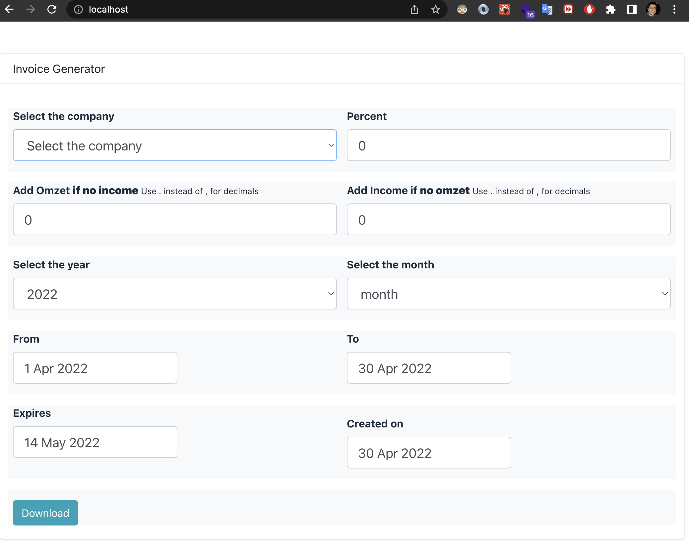
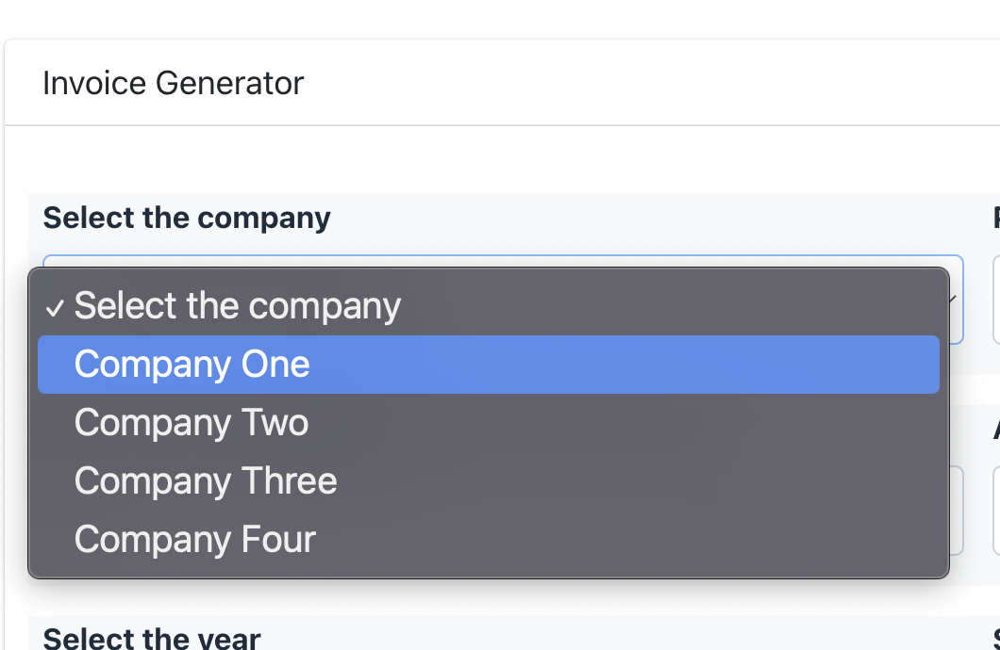
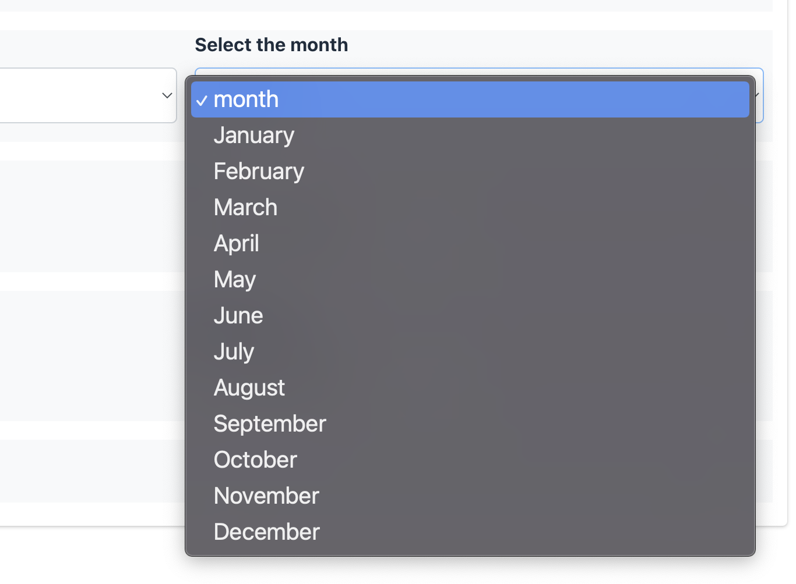
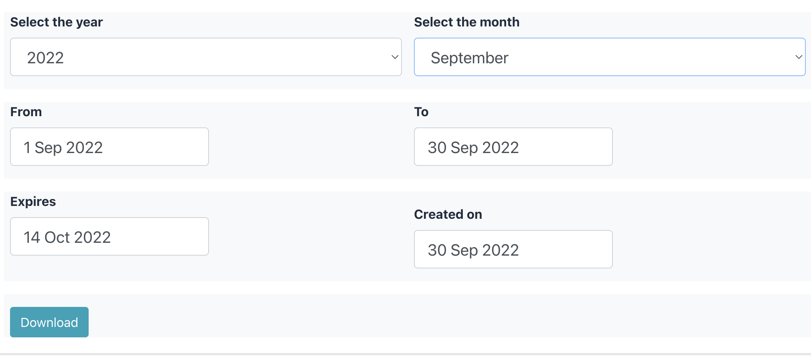
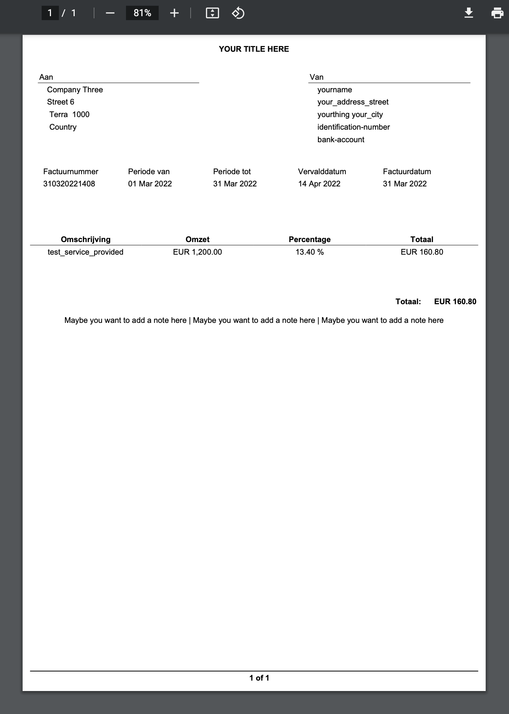

Small invoicing system

## to start locally

### 
 - `docker-compose up` // consult docker-compose and nginx-dev.conf
 - `Run InvoicingApplication`
 - `cd reactjs-ui`
 - `npm install`
 - `npm start`
 - `localhost`  // if nginx-dev.conf is used, then port 80 is routed to 3000(UI) and 20221(API)

### cheers to
 - [https://github.com/ColorlibHQ/AdminLTE](https://github.com/ColorlibHQ/AdminLTE)
 - [https://github.com/dynamicreports/dynamicreports](https://github.com/dynamicreports/dynamicreports)
 - [https://github.com/spring-projects/spring-boot](https://github.com/spring-projects/spring-boot)
 - [https://github.com/nginx/nginx](https://github.com/nginx/nginx)
 - [https://github.com/docker](https://github.com/docker)
 - [https://github.com/react-bootstrap/react-bootstrap](https://github.com/react-bootstrap/react-bootstrap)
 - [https://github.com/apache/maven](https://github.com/apache/maven)

### Demo

